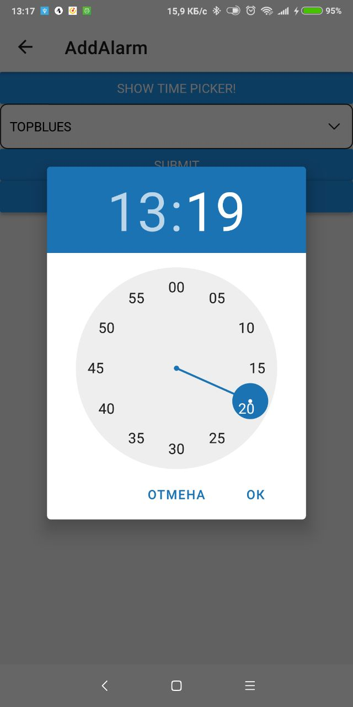
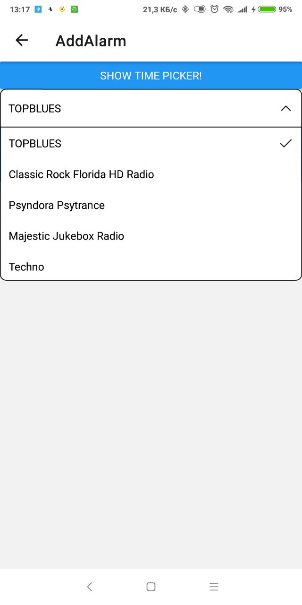
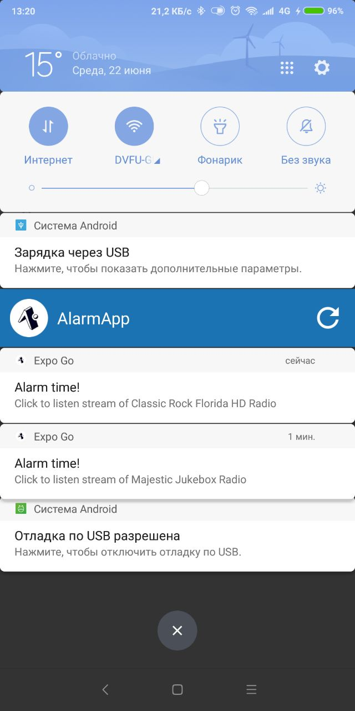

Open notification list | Add alarm | Select radio stream | Wait push notidication | Listen radio |
 --| -- | -- | --
  |  |  |  | 

 ## Getting Started

 It based on expo react native. 

 ```
 expo install
 expo start -c
 ```
